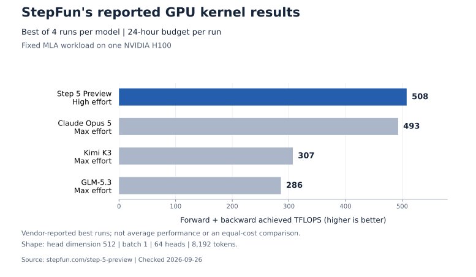
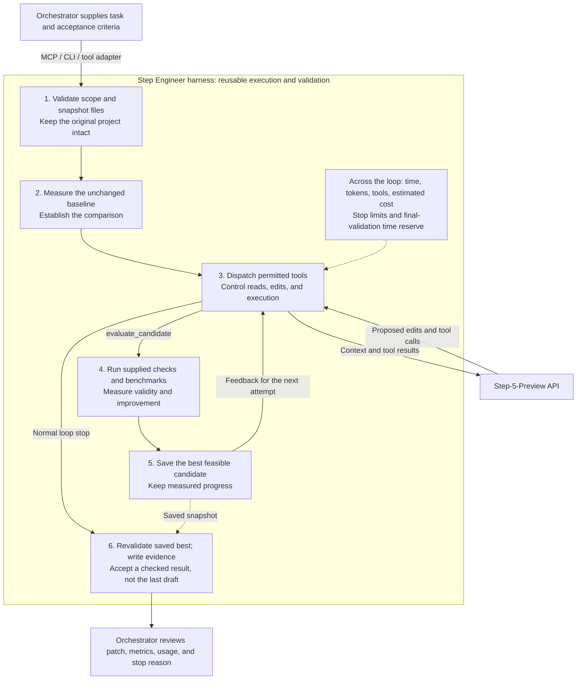

# Step Engineer

A reusable, **Step-5-Preview-specific agent harness** for optimization under explicit constraints and measurable feedback. Use its ready-made MCP server and CLI, or build your own interfaces around its reusable Python components. GPT, Grok, Claude, or another agent can orchestrate the work while Step proposes and tests improvements.

The current implementation works on local source-file tasks: it edits an isolated copy, measures candidates against fixed checks, preserves the best qualifying version, and returns a patch with verification evidence. Engineering optimization is the first supported application of the harness.

Your parent agent keeps its existing model and reasoning settings, including Ultra where supported. Step Engineer does not replace the parent agent, apply patches to the original project, or publish changes.

**[繁體中文說明](docs/README.zh-TW.md)** · **[Why Step? Evidence and charts](docs/step-evidence.md)** · [Build your MCP / CLI](docs/integrations.md#build-your-own-cli-or-mcp) · [Parent-agent instructions](docs/parent-agent-instructions.md) · [Live case study](docs/case-study.md)

## Why a harness for Step?

The target task has three properties: **explicit constraints, an objective evaluator, and room to explore better solutions**. The orchestrator defines success; Step uses tool feedback to search within those boundaries. StepFun's GPU-kernel and training-data experiments motivate this specialization. They are vendor evidence, not a guarantee that Step beats other models on every constrained task.



*Vendor-reported results, checked 2026-09-26: a fixed MLA workload on one H100, with a 24-hour budget per run. This compares best runs with different reasoning settings, not averages or equal-cost results. [Official presentation](https://www.stepfun.com/step-5-preview); [method, source data, and limitations](docs/step-evidence.md).*

Our own live case reduced fresh nine-pose composition time by **10.57%**, with identical RGBA outputs in the tested cases. Two preceding attempts produced no patch. This is one local workload, not a comparative model benchmark. The [evidence guide](docs/step-evidence.md) separates official results, our measurements, and untested hypotheses, and explains which model capabilities this harness currently uses.

## How other agents use it

### What the harness does, and why it exists

Step proposes the next change. The harness turns those proposals into a bounded,
measured search: it controls the editable state, supplies execution feedback, and
decides whether the saved result meets the caller's acceptance criteria. This
runtime is the part developers reuse behind their MCP or CLI.



The diagram shows the normal optimization path. An invalid baseline stops before
model iteration. Cancellation or an execution error records a termination result;
it does not guarantee final validation or an accepted patch.

| Harness mechanism | Why it is needed | Implementation |
| --- | --- | --- |
| Validate the job, snapshot selected files, restrict edits | Give every trial a defined scope and preserve the original project | [JobSpec](src/step_engineer/models.py), [Workspace](src/step_engineer/workspace.py) |
| Measure a baseline and repeated candidate runs | Establish a comparable starting point; reduce reliance on a single favorable timing | [Harness.measure](src/step_engineer/harness.py) |
| Dispatch a fixed set of tools and sandbox supplied commands | Turn model requests into controlled execution with file, network, and output limits | [Harness.dispatch](src/step_engineer/harness.py), [runner](src/step_engineer/runner.py) |
| Return measured tool feedback to Step | Let the next attempt respond to observed failures and scores | [Harness.optimize](src/step_engineer/harness.py), [Step client](src/step_engineer/provider.py) |
| Save only a better feasible candidate | Preserve measured progress when later attempts regress or remain untested | [Harness.evaluate](src/step_engineer/harness.py), [Workspace.save_best](src/step_engineer/workspace.py) |
| Bound iteration and reserve time for final checks | Give exploratory work a stopping policy and leave room to verify the result | [Harness.optimize](src/step_engineer/harness.py) |
| Recheck a fresh copy of saved best and write artifacts | Let the caller inspect the actual candidate, measurements, usage, and acceptance decision | [Harness.verify_final](src/step_engineer/harness.py), [Harness.run](src/step_engineer/harness.py) |

**Ownership:** the orchestrator supplies the objective, checks, benchmark, thresholds,
and optional independent final checks. The harness executes these supplied evaluators
and records runtime evidence; it does not design the tests or constitute a cross-model
evaluation platform. Step proposes changes and reacts to feedback. The orchestrator
reviews the result and decides whether to apply it.

Saving `best` is automatic after a qualifying measurement; restoring the working
candidate requires the `restore_best` tool. Final validation uses a fresh copy of
saved `best`, and `accepted.patch` contains changes only after acceptance. Without
separate `final_checks`, the result reports `independently_checked=false`. Estimated
cost limits and the validation-time reserve do not guarantee an exact bill or a
successful final check.

The final-validation allowance is deducted from both model-request and development
command deadlines. Reaching that exploration deadline stops further tool dispatch
and hands the saved best to final validation. Baseline and final checks use the
remaining job deadline. The allowance retains a 40% job-time cap, and process
cleanup adds overhead, so it remains a best-effort reservation.

### Where MCP and CLI fit

MCP and CLI are entry points to this runtime. The built-in CLI calls `Harness`
directly; MCP and the documented custom wrappers use `JobService` for allowed source
roots, background jobs, polling, and cancellation. The caller owns the process/session
lifetime. Cloud models issue tool calls through a local host; they do not directly
access your filesystem. See [custom interfaces](docs/integrations.md#build-your-own-cli-or-mcp).

| Your starting point | Reuse this layer |
| --- | --- |
| An agent with MCP support | Launch the [built-in stdio server](docs/integrations.md#local-mcp-stdio) |
| A terminal or automation script | Use `step-engineer run job.json` |
| Your own domain-specific MCP or CLI | Wrap `JobService` or extend the server; see [working examples](docs/integrations.md#build-your-own-cli-or-mcp) |
| An existing GPT, Grok, or Claude API tool loop | Use [`ToolBridge`](docs/integrations.md#existing-gpt-grok-or-claude-api-loops) |

The current release provides reusable Python components and examples; it does not generate a new MCP/CLI project automatically. Candidate execution currently requires macOS. Larger-context and multimodal model capabilities are documented separately from what this text-based worker exposes.

## What it provides

- A Step API client with bounded requests, usage accounting, and no automatic retries.
- An optimization loop with explicit file permissions, correctness checks, repeated benchmarks, and separate final validation.
- A macOS process sandbox for fixed, parent-owned commands.
- CLI and asynchronous MCP stdio interfaces.
- Tool schemas and local dispatch for OpenAI Responses, Grok Chat Completions, and Claude tools.
- A fully local, scripted demonstration that requires no API key.

The default worker setting is `medium`, with up to **16,384 output tokens and 300 seconds per request**, and **250,000 total tokens per job**. These are a starting configuration, not a guarantee of improvement. In one live workload, two `high` attempts exhausted their output limits without producing a patch; a `medium` attempt produced a verified improvement. See the [case study](docs/case-study.md) for the failures, measurements, and limits of that comparison.

## Requirements

- **macOS with `/usr/bin/sandbox-exec`**. Candidate execution fails closed on unsupported systems; there is no unsandboxed fallback.
- Python **3.11 or newer**. Python **3.12 is recommended** for the tested setup.
- [uv](https://docs.astral.sh/uv/) to install the locked dependencies.
- For live optimization: a Step API key with model access and sufficient provider quota.

The sandbox supports the installed Python runtime and narrow system paths. Other runtimes or compilers may need additional setup. Validate the required toolchain before delegating a job; do not disable isolation to work around a missing runtime.

## Start with the offline demo

Clone the repository, then run the demo:

```sh
git clone https://github.com/ShemYu/step-engineer.git
cd step-engineer
uv sync --frozen --python 3.12
uv run step-engineer run examples/batch_aggregation/job.json --offline-demo
```

This runs the real harness and sandbox with a **handwritten, scripted solution**. It demonstrates the pipeline; it is **not a Step model benchmark**. The [example documentation](examples/batch_aggregation/README.md) explains the contract and verification.

## Configure a live worker

Copy the credential template and restrict access:

```sh
cp .env.example .env.local
chmod 600 .env.local
```

Edit `.env.local` locally and set the placeholder to your own key:

```dotenv
STEP_API_KEY=YOUR_STEP_API_KEY
STEP_BASE_URL=https://api.stepfun.ai/v1
```

Never commit this file, paste the key into a model prompt, or include credential files in a job. The client accepts the documented Step endpoint only. `STEPFUN_API_KEY` is a fallback variable; an existing process environment takes precedence over `--env-file`.

```sh
uv run step-engineer --env-file .env.local doctor
uv run step-engineer --env-file .env.local run examples/batch_aggregation/job.json
```

`doctor` checks local configuration and sandbox availability. It does not verify authentication, quota, or model access. Live submission sends selected source and tool feedback to StepFun and can incur charges.

The bundled live job uses `medium`, at most **12 model requests, 24 tool calls, 600 seconds, 250,000 total tokens, and an estimated US$0.50**. Its per-request limits are 300 seconds and 16,384 output tokens.

## Delegate from a parent agent

A local MCP host can launch the stdio server:

```sh
uv run --project /absolute/path/to/step-engineer step-engineer \
  --env-file /absolute/path/to/private/step.env \
  --runs-dir /absolute/path/to/optimization-runs \
  serve --allow-root /absolute/path/to/your-project
```

All paths above are placeholders. Repeat `--allow-root` for each authorized source root. If omitted, only the bundled example is allowed. No HTTP port is opened.

| Tool | Input | Result |
| --- | --- | --- |
| `submit_optimization` | `job` | Starts a job and promptly returns its `run_id` |
| `get_optimization_status` | `run_id` | Progress, termination state, and estimated cost |
| `get_optimization_result` | `run_id` | Measurements, validation, and artifact paths |
| `cancel_optimization` | `run_id` | Cancels an active local job |

Keep the MCP session alive for the job. Closing the server cancels its active jobs; restarting it does not resume them or send new model requests.

GPT, Grok, or Claude can be the parent, but a **local application must execute their tool calls**. A cloud model cannot directly access this machine's filesystem or `localhost`. The [integration guide](docs/integrations.md) covers Codex, Claude Code, and the provider-neutral Python adapter. Adapter schemas and dispatch have local tests; paid end-to-end tests against all three parent providers are not claimed.

## Define a job

Copy [the example job](examples/batch_aggregation/job.json), then inspect the full schema:

```sh
uv run step-engineer schema
```

| Field | Purpose |
| --- | --- |
| `source_dir` | Source directory; relative to the job JSON in the CLI, absolute in MCP |
| `files` | Explicit UTF-8 files to copy; no directories, symlinks, hidden files, or traversal |
| `editable_files` | Existing files the worker may change; a subset of `files` |
| `final_only_files` | Non-editable files withheld from development tools until final validation |
| `objective` | Required behavior, optimization target, and prohibited tradeoffs |
| `checks` | Parent-owned correctness commands that must exit successfully |
| `benchmark` | Parent-owned measurement command |
| `final_checks` | Independent final validation; strongly recommended for real work |
| `metric` / `direction` | Metric name and `minimize` or `maximize` |
| `constraints` | Numeric conditions required in every benchmark repetition |
| `repetitions` | Repeated measurement count; scores use the median |
| `minimum_relative_improvement` | Required final improvement, e.g. `0.10` for 10% |
| `reasoning_effort` | Step worker effort: `low`, `medium` (default), or `high` |
| `budget` | Request, tool, token, time, estimated cost, and stagnation limits |

Commands use argv arrays, without shell expansion. `{python}` selects the installed interpreter; `{workspace}` and `{scratch}` expand to isolated directories. The command workspace is read-only. Write build products and temporary files to scratch.

`elapsed_seconds` is measured externally and includes process startup, input preparation, and cleanup. A trusted benchmark may emit custom metrics as its last JSON line:

```json
{"metrics":{"recall":0.98,"qps":4200}}
```

Program output cannot override external `elapsed_seconds`. Missing or non-finite metrics, failed checks, timeouts, and output/storage limit violations reject the measurement. A custom stdout score is still only as trustworthy as its evaluator.

## Budgets and acceptance

Generic defaults are 12 model turns, 40 tool calls, 600 seconds, 250,000 total tokens, an estimated US$1, and four evaluations without improvement. Each request is capped at 16,384 output tokens and 300 seconds. The bundled example tightens the tool and estimated cost limits.

`max_request_seconds` accepts 5–600 seconds. Its effective limit is also capped by the job's remaining time after a final-validation reserve. Token and estimated cost reservations can stop a job before its nominal maxima. Longer output limits include reasoning tokens, not just visible answers.

Cost estimates use US$1 per million input tokens and US$2.70 per million output tokens, checked on 2026-09-26, and ignore cache discounts. They are conservative local estimates, **not a billing guarantee**. Interrupted or timed-out requests can still be billed; uncertain usage is marked, and requests are not automatically retried.

The harness first measures the unchanged snapshot. Only a qualifying, better evaluated candidate becomes `best`. Final validation uses a fresh copy of that saved version. **An unmeasured last edit never replaces the saved best.** Budget exhaustion and acceptance are reported separately: a run may exhaust its budget while an earlier measured candidate still passes final verification.

Improvement-threshold comparisons allow score-scale floating-point roundoff at
the boundary, while still requiring a strictly better score. This tolerance does
not relax metric constraints or compensate for benchmark noise.

`max_no_improvement` counts completed candidate evaluations that do not improve
the saved best, including infeasible candidates. A new best resets the count;
reads, writes, and rejected tool arguments do not increment it. Reaching the
limit stops the rest of the tool batch and proceeds to final validation.

The [guard-repair case study](docs/guard-repair-case-study.md) records four bounded
Step attempts and the subsequent developer-agent repairs and parent review,
including failures and costs. It is not a model benchmark.

Artifacts are written under `runs/<run_id>/` in the current working directory by default. Set `--runs-dir` explicitly when integrating a host:

| Artifact | Meaning |
| --- | --- |
| `result.json`, `report.md` | Outcome, usage, measurements, and validation |
| `accepted.patch` | Nonempty only when the saved best passes final acceptance |
| `best-development.patch` | Diagnostic patch; not approved for application |
| `source-manifest.json` | Input hashes for checking source drift |
| `evaluations.json`, `events.jsonl` | Measurement and event records |

Inspect `accepted`, `final_validation`, and `stop_reason` together. Without separate `final_checks`, the harness reruns normal checks and the benchmark but reports `independently_checked=false`. The original source directory remains unchanged; applying a patch is a parent-owned decision.

## Data and isolation boundaries

**Live jobs send selected visible source contents and tool feedback to StepFun.** Exclude credentials, unrelated data, and material you cannot share with that provider. Final-only files are withheld from the worker's development tools, but are visible to the program being tested during final validation.

The runner blocks network access, prevents writes to the command workspace, restricts filesystem reads, and constructs a clean child environment without API keys. Output is capped at 16 KiB per stream; scratch has a 16 MiB per-file limit and a monitored 64 MiB aggregate limit. Scratch is removed after commands.

This is a guardrail for personal engineering work, not a VM or a hostile multi-tenant execution service. Escaped descendants and tampering inside the same interpreter require stronger isolation. Source copies, reports, patches, or test output can contain sensitive project data; review them before sharing. Raw model reasoning is kept in memory for tool continuity, not saved in reports.

## Development checks

```sh
uv sync --frozen --python 3.12
uv run pytest -q
uv run ruff check src tests
```

Tests cover provider HTTP mocks, state transitions, path boundaries, real macOS sandbox execution, and MCP stdio. Passing them establishes harness behavior; it does not establish a model's quality on an unseen workload.

## References

- [Step 5 Preview: official model capabilities and limits](https://platform.stepfun.ai/docs/en/guides/models/step-5-preview)
- [Step 5 Preview: official experiments and results](https://www.stepfun.com/step-5-preview)
- [Step quickstart](https://platform.stepfun.ai/docs/en/quickstart/overview)
- [Step Chat Completions](https://platform.stepfun.ai/docs/en/api-reference/chat/chat-completion-create)
- [Step tool calls](https://platform.stepfun.ai/docs/en/api-reference/tool-call)
- [Step reasoning](https://platform.stepfun.ai/docs/en/guides/developer/reasoning)
- [Step pricing](https://platform.stepfun.ai/docs/en/guides/pricing/details)
- [Evidence, chart data, and the complete official-documentation directory](docs/step-evidence.md)
- [MCP Python SDK v1](https://github.com/modelcontextprotocol/python-sdk/tree/v1.x)

This project uses the MCP Python SDK v1 interface.

## License

[MIT](LICENSE). The private application assets described in the case study are not included or licensed by this repository.
