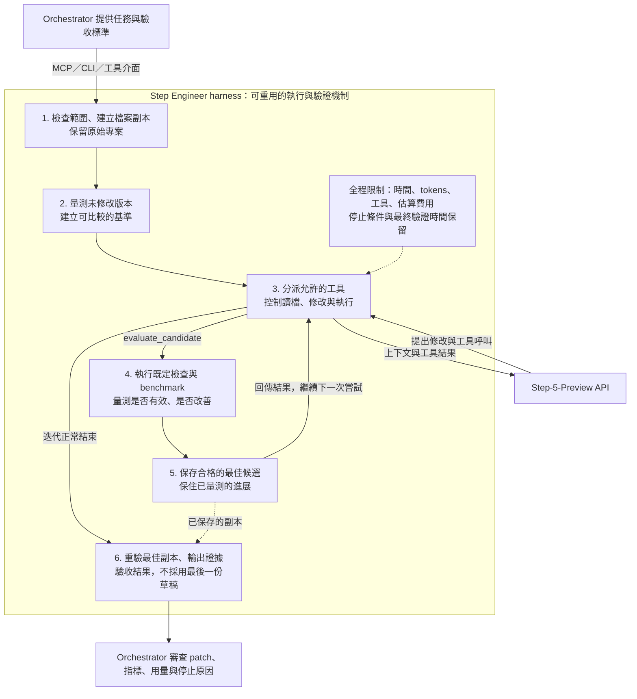

# Step Engineer：繁體中文說明

[English README](../README.md) · **[Step 強項：數據與圖表](step-evidence.zh-TW.md)** · [自訂 MCP／CLI](integrations.md#build-your-own-cli-or-mcp) · [委派指示](parent-agent-instructions.md) · [真實案例](case-study.md)

Step Engineer 是**專為 Step-5-Preview 設計的可重用 agent harness**，讓開發者透過現成或自訂的 MCP、CLI，把「明確約束下、可量測並反覆改進的任務」交給 Step。GPT、Grok、Claude 或其他 agent 可以擔任 orchestrator，負責需求、評分標準與最終採用，保留原本模型與推理設定，例如支援時使用 Ultra。

目前實作以本機原始碼任務為範圍：在副本裡修改、測試、量測，保存已驗證的最佳候選，交回 patch 與證據。工程最佳化是第一種已支援的應用。套件提供現成介面、可重用 Python 元件與範例；目前沒有自動產生新 MCP／CLI 專案的 generator。

## 為什麼針對 Step 設計？

我們鎖定的任務同時具備：**規則與限制明確、結果可以客觀評分、仍有值得探索的解法空間**。主 Agent 定義「什麼才算更好」，Step 根據工具回饋提出並改進方案。


*官方展示，查核於 2026-09-26：單張 H100、固定 MLA 工作負載、每次 24 小時預算、每模型四次取最佳。推理設定不同，也不是平均表現或相同費用的比較。[官方來源](https://www.stepfun.com/step-5-preview)；[完整數據、解讀與限制](step-evidence.zh-TW.md)。*

我們自己的真實案例，在測試涵蓋的 RGBA 輸出保持一致時，讓九姿勢重新合成耗時降低 **10.57%**；此前兩次嘗試沒有產生 patch。這支持此任務的可行性，還不能證明 Step 普遍優於其他模型。[能力與證據頁](step-evidence.zh-TW.md)分開整理官方結果、本地實測、待驗證假設，以及模型功能與本 harness 目前支援範圍的差異。

## Harness、Step 與 orchestrator 的分工

### Harness 做什麼，為什麼需要它？

Step 提出下一個修改方向；harness 把這些提案變成有範圍、可量測的搜尋過程：管理可修改的狀態、回傳執行結果，並判斷保存的候選是否符合呼叫端設定的驗收條件。開發者建構自己的 MCP／CLI 時，重用的就是這一層執行機制。



圖中呈現正常優化流程。若基準版本不合格，就不進入模型迭代；取消或執行錯誤會記錄停止結果，不保證完成最終驗證或產生已接受的 patch。

| Harness 的機制 | 為什麼需要 | 對應實作 |
| --- | --- | --- |
| 檢查工作契約、複製指定檔案、限制可修改範圍 | 讓每次試驗有清楚邊界，並保留原始專案 | [JobSpec](../src/step_engineer/models.py)、[Workspace](../src/step_engineer/workspace.py) |
| 量測 baseline，重複測量候選版本 | 建立比較起點，降低單次偶然較快造成的誤判 | [Harness.measure](../src/step_engineer/harness.py) |
| 分派固定工具，在 sandbox 執行提供的命令 | 將模型請求轉為受控操作，限制檔案、網路與輸出 | [Harness.dispatch](../src/step_engineer/harness.py)、[runner](../src/step_engineer/runner.py) |
| 把實際工具結果回傳 Step | 讓下一次修改依據觀察到的失敗與分數調整 | [Harness.optimize](../src/step_engineer/harness.py)、[Step client](../src/step_engineer/provider.py) |
| 僅保存合格且更好的候選 | 後續嘗試退步或尚未測試時，仍保有已量測的進展 | [Harness.evaluate](../src/step_engineer/harness.py)、[Workspace.save_best](../src/step_engineer/workspace.py) |
| 限制迭代、為最終驗證保留時間 | 讓探索有停止條件，留下檢查成果的空間 | [Harness.optimize](../src/step_engineer/harness.py) |
| 從最佳版本建立新副本重驗，輸出產物 | 讓呼叫端檢查實際修改、量測、用量與驗收決定 | [Harness.verify_final](../src/step_engineer/harness.py)、[Harness.run](../src/step_engineer/harness.py) |

**責任邊界：**目標、測試、benchmark、門檻，以及可選的獨立最終檢查，都是 orchestrator 提供。Harness 執行這些既定評測並記錄當次工作的證據；它不負責設計測試，也不是跨模型比較的評測平台。Step 提出修改並依回饋調整，orchestrator 審查後決定是否採用。

合格且更好的量測結果會自動保存為 `best`；還原工作中的候選版本則需要呼叫 `restore_best`。最終驗證使用已保存 `best` 的新副本，通過驗收後 `accepted.patch` 才包含修改。沒有另設 `final_checks` 時，結果會標示 `independently_checked=false`。估算費用上限和時間保留機制不保證精確帳單或最終檢查一定成功。

### MCP／CLI 放在哪一層？

MCP 與 CLI 是這套執行機制的入口。內建 CLI 直接使用 `Harness`；MCP 與文件中的自訂 wrapper 使用 `JobService`，增加允許的來源目錄、背景工作、狀態查詢與取消管理。呼叫端負責程序／session 的生命週期。雲端模型提出工具呼叫後，仍由本機 host 執行，並不直接存取電腦。自訂方式見 [MCP／CLI 範例](integrations.md#build-your-own-cli-or-mcp)。

| 你要建構的介面 | 可重用的部分 |
| --- | --- |
| 支援 MCP 的 agent | 直接啟動內建 stdio server |
| 終端機或自動化流程 | 使用 `step-engineer run job.json` |
| 自己領域的 MCP／CLI | 包裝 `JobService` 或擴充 server，見[可用範例](integrations.md#build-your-own-cli-or-mcp) |
| 既有 GPT／Grok／Claude API 工具迴圈 | 透過 `ToolBridge` 取得 schema 並執行本機 dispatch |

預設是 `medium`、每次最多 **16,384 輸出 tokens／300 秒**、全程最多 **250,000 tokens**。這是目前可用的起點，不是成功保證。本次一個真實任務中，high 配合 8,192 與 16,384 輸出上限的兩次嘗試都未產生 patch；medium 一次產生通過驗收的版本。單一案例不能證明 medium 普遍優於 high。

## 環境需求

- **macOS 與 `/usr/bin/sandbox-exec`**。其他平台拒絕執行候選程式，沒有自動退回無隔離模式。
- Python **3.11+**；建議使用已驗證的 **3.12**。
- [uv](https://docs.astral.sh/uv/)。
- 真實模型工作需要 Step API key、模型存取權與足夠額度。

隔離器支援安裝中的 Python runtime 與有限系統路徑。其他 runtime／compiler 可能需要額外設定；先驗證工具鏈，不要停用隔離來繞過問題。

## 先跑不需要 key 的範例

先取得 repository，再執行範例：

```sh
git clone https://github.com/ShemYu/step-engineer.git
cd step-engineer
uv sync --frozen --python 3.12
uv run step-engineer run examples/batch_aggregation/job.json --offline-demo
```

這會使用真實 harness 與 sandbox，但解答是**人工預寫的 scripted solution**。它驗證執行流程，不能當作 Step 模型效能成果。[範例說明](../examples/batch_aggregation/README.md)列出完整行為契約。

## 設定真正的 Step 工作

```sh
cp .env.example .env.local
chmod 600 .env.local
```

在本機編輯 `.env.local`，將下列占位文字換成自己的 key：

```dotenv
STEP_API_KEY=YOUR_STEP_API_KEY
STEP_BASE_URL=https://api.stepfun.ai/v1
```

不要 commit 此檔、把 key 貼進 prompt，或把憑證加入 `job.files`。也支援 fallback 變數 `STEPFUN_API_KEY`；既有程序環境的值優先於 `--env-file`。Base URL 僅接受已確認的官方 Step endpoint。

```sh
uv run step-engineer --env-file .env.local doctor
uv run step-engineer --env-file .env.local run examples/batch_aggregation/job.json
```

`doctor` 只檢查本機設定與隔離器是否可用，不驗證認證、額度或模型存取。**Live job 會把選定的可見原始碼與工具回饋送到 StepFun，並可能產生費用。**

範例使用 medium，最多 12 次模型請求、24 次工具呼叫、全程 600 秒／250,000 tokens、每次 300 秒／16,384 輸出 tokens、保守估算 US$0.50。一般 JobSpec 預設則為 40 次工具呼叫與 US$1；其他主要上限相同。

## 接上 GPT、Grok 或 Claude

由本機 MCP host 啟動 stdio server：

```sh
uv run --project /absolute/path/to/step-engineer step-engineer \
  --env-file /absolute/path/to/private/step.env \
  --runs-dir /absolute/path/to/optimization-runs \
  serve --allow-root /absolute/path/to/your-project
```

以上都是占位路徑。每個允許的專案分別指定 `--allow-root`；省略時只允許隨附範例。Server 不開放 HTTP port。

| 工具 | 用途 |
| --- | --- |
| `submit_optimization(job)` | 快速提交並取得 run ID |
| `get_optimization_status(run_id)` | 查進度、狀態與估算費用 |
| `get_optimization_result(run_id)` | 讀量測、最終驗收與產物路徑 |
| `cancel_optimization(run_id)` | 取消本機工作 |

工作期間必須保持同一個 MCP session。Server 關閉會取消進行中的工作；重啟不會自動續跑或重新呼叫模型。

GPT、Grok、Claude 可以是主模型，但**工具必須由有權存取檔案的本機應用程式執行**。雲端模型不能直接存取這台 Mac 的檔案或 localhost。已有三種 provider 格式的 Python adapter 與離線測試；不宣稱完成三家主模型各自的付費端到端驗證。完整範例見 [integrations](integrations.md)。

## 撰寫工作契約

複製 [example job](../examples/batch_aggregation/job.json)，並查看 schema：

```sh
uv run step-engineer schema
```

- `source_dir`：CLI 相對於 job JSON 所在目錄解析；MCP 必須使用絕對路徑。
- `files`／`editable_files`：明列要複製與可修改的既有 UTF-8 檔案；拒絕資料夾、symlink、隱藏檔與路徑穿越。
- `objective`：寫清楚行為、目標與不能犧牲的條件。
- `checks`／`benchmark`：由主 Agent 擁有的固定功能檢查與量測命令，採 argv，不經 shell 展開。
- `final_only_files`／`final_checks`：獨立驗收資料與命令，開發階段不提供給 Step；真實工作建議設定。
- `metric`／`direction`／`constraints`：指標、優化方向、每次量測都必須滿足的限制。
- `repetitions`／`minimum_relative_improvement`：重複次數與最小改善幅度，使用中位數比較。
- `reasoning_effort`／`budget`：worker effort 與請求、工具、token、時間、估算費用、無改善次數上限。

`{python}` 使用已安裝的 Python；`{workspace}` 與 `{scratch}` 是隔離目錄。命令執行時 workspace 唯讀，編譯產物與暫存寫入 scratch。其他工具鏈需先驗證可用性。

外部 runner 的 `elapsed_seconds` 包含啟動、資料建立與清理成本。可信任 benchmark 可在最後一行提供 JSON metrics；stdout 無法覆寫外部耗時。缺少指標、非有限值、檢查失敗、逾時或輸出／儲存超限都會拒絕該次量測。自行輸出的分數仍需要可信任評測設計。

## 預算、最佳版本與驗收

單次 deadline 同時受到 `max_request_seconds`（預設 300，可設 5–600）及全局剩餘時間扣除驗收保留時間限制。Token 與估算費用使用請求前保留額，可能在表面上限前停止。輸出上限包含 reasoning tokens，不只可見答案。

費用採 2026-09-26 查核的輸入 US$1/M、輸出 US$2.70/M，忽略快取折扣。這是本機保守估算，**不是帳單保證**。取消或逾時仍可能被計費；程式標示不確定性，不自動重試。

只有通過檢查且量測更好的候選會成為 `best`。最終驗收從這個已保存版本重新建立副本。**最後一次未量測的寫入不會覆蓋最佳版本。** 因此要分開看停止原因與驗收結果：預算用完時，先前的最佳版本仍可能通過最後驗收。

| 產物 | 意義 |
| --- | --- |
| `result.json`／`report.md` | 狀態、量測、用量與驗收 |
| `accepted.patch` | 最佳版本通過最終驗收後才含修改 |
| `best-development.patch` | 僅供診斷，不能當作驗收通過 |
| `source-manifest.json` | 原始檔 hashes，套用前檢查來源是否變動 |
| `evaluations.json`／`events.jsonl` | 量測與事件紀錄 |

產物預設放在目前工作目錄的 `runs/<run_id>/`；接入 host 時明確指定 `--runs-dir`。一起檢查 `accepted`、`final_validation` 和 `stop_reason`。未設定獨立 `final_checks` 時，仍重跑一般檢查與 benchmark，但 `independently_checked=false`。原始目錄不被修改，套用 patch 由主 Agent 負責。

## 隔離與資料界線

只選可分享給 StepFun、與任務相關的原始碼與測試回饋。不要把敏感內容藏在一般程式檔裡。Final-only 檔案不提供給 worker 的開發工具，但最終驗收時，被測程式可以讀到它們。

Sandbox 禁止網路、限制讀檔並防止寫入命令 workspace；子程序使用不含 API key 的乾淨環境。每個輸出 stream 上限 16 KiB、scratch 單檔 16 MiB、總量 64 MiB 為週期監測限制，命令結束清除 scratch。

這是個人本機工程工具，不是 VM 或供陌生人執行任意程式的服務。逃離 process group、同一 interpreter 內篡改評測等情況需要更強隔離。原始碼副本、patch、報告與測試輸出也可能包含私人資料，分享前要檢查。Raw reasoning 僅保留於記憶體以延續工具呼叫，不寫入報告。

## 開發驗證

```sh
uv sync --frozen --python 3.12
uv run pytest -q
uv run ruff check src tests
```

測試涵蓋 HTTP mock、harness 狀態、路徑界線、真實 macOS sandbox 與 MCP stdio。測試通過證明框架行為，不能代替特定任務的真實模型評估。

## Step 官方文件

- [Step 5 Preview：模型能力與限制](https://platform.stepfun.ai/docs/en/guides/models/step-5-preview)
- [官方模型介紹與實驗](https://www.stepfun.com/step-5-preview)
- [Quickstart：第一次 API 呼叫](https://platform.stepfun.ai/docs/en/quickstart/overview)
- [Chat Completions API](https://platform.stepfun.ai/docs/en/api-reference/chat/chat-completion-create)
- [Tool calling](https://platform.stepfun.ai/docs/en/api-reference/tool-call)
- [Reasoning effort](https://platform.stepfun.ai/docs/en/guides/developer/reasoning)
- [價格與速率限制](https://platform.stepfun.ai/docs/en/guides/pricing/details)
- [完整證據、圖表資料與官方文件索引](step-evidence.zh-TW.md)

## 授權

[MIT](../LICENSE)。案例提到的私人應用程式素材不包含在此 repository，也不由此授權。
