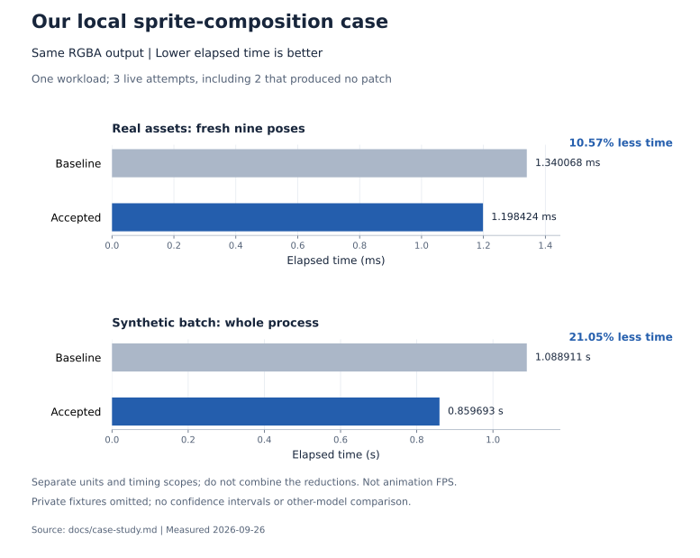

# Live case study: sprite composition

[English README](../README.md) · [繁體中文](README.zh-TW.md) · [Step evidence and charts](step-evidence.md)

On 2026-09-26, Step Engineer was used through its local MCP interface to optimize a JavaScript sprite-composition function. The target was generating a fresh set of nine poses when appearance or equipment changed. The browser already cached finished frames, so **this was not a playback-FPS experiment**.

The parent supplied the task contract, development checks, benchmark, and independent validation. Step edited an isolated copy. The original project was not modified during the experiment.

## Scope and reproducibility

This is a sanitized record of one local workload, not a public benchmark leaderboard. The original application code, artwork, reference images, private fixtures, raw job artifacts, and local paths are intentionally omitted from this repository. The exact real-asset result cannot be independently reproduced from this release. The public batch-aggregation example demonstrates the harness but is a different workload and uses a scripted solution in offline mode.

The evaluation required identical dimensions and RGBA bytes, preserved layer order and anchors, correct mirrored/rotated/scaled sampling, stable previous outputs, and observation of later input mutations. Whole-output caching and fixture-specific behavior were prohibited.

## Attempts, including failures

| Attempt | Step effort | Output limit per request | Outcome |
| --- | --- | --- | --- |
| 1 | `high` | 8,192 tokens | Output budget exhausted; no patch produced |
| 2 | `high` | 16,384 tokens | Output budget exhausted; no patch produced |
| 3 | `medium` | 16,384 tokens | A previously evaluated best candidate passed final validation |

The second attempt also received a longer request deadline. The successful attempt retained the expanded output/deadline allowance and used `medium`; remaining estimated cost limits differed. These were sequential engineering trials, not repeated, controlled experiments that isolate reasoning effort. One successful medium run does not show that medium generally outperforms high.

The successful run made **8 model requests and 11 tool calls**, used **126,365 tokens**, and took **292.522 seconds**. The conservative API estimate across **all three attempts** was **US$0.25212**, including failures. It uses the configured input/output prices without cache discounts and is not an independently reconciled provider invoice. Runtime and price results depend on hardware, workload, provider behavior, and rates.

## What changed

The accepted implementation moved invariant bounds and field reads outside pixel loops, expanded the three RGB channel updates, and omitted division only when the scale was exactly one. Non-unit scales retained the original division. The reviewed patch introduced no new dependencies, persistent caches, or fixture-specific branches.

The run ultimately stopped at its **total-token budget**. A later third draft in the working candidate directory had not been evaluated and was excluded. The harness preserved the earlier measured best and performed final validation on that saved version. This distinction matters: a budget stop is not itself success, and the last file written is not automatically the accepted implementation.

## Measurements

The figure uses [reviewed aggregate data](data/step-evidence.json). It does not
include private code or artwork, or reconstruct a trial-by-trial timing series.

| Workload and metric | Baseline | Accepted version | Reduction |
| --- | ---: | ---: | ---: |
| Synthetic batch, external process elapsed time | 1.0889 s | 0.8597 s | 21.05% |
| Real assets, fresh nine-pose composition | 1.340068 ms | 1.198424 ms | 10.57% |

Synthetic timing includes process startup, input preparation, composition, and cleanup. The benchmark used 64 distinct configurations × nine poses × four passes; eight configurations were warmed beforehand. It did not represent 256 distinct, first-ever configurations. A narrow checksum served as a benchmark guard; full-RGBA correctness was checked separately.

The real-asset follow-up used alternating baseline/candidate runs (ABAB ordering) and fresh output composition. Its timing scope differs from external process elapsed time, so the two reductions should not be combined. Neither number measures browser rendering, animation playback, or end-to-end user interaction latency. No universal speedup or statistical confidence interval is claimed.

## Correctness evidence

The accepted saved version passed:

- **160 development composition cases**, with additional exported-contract checks.
- **2,016 real-asset composition cases** during independent final verification.
- Comparisons involving **63 reference frames**.
- **5,500 independent synthetic full-RGBA differential comparisons**, including fractional origins, negative and near-zero scales, rotations near sensitive boundaries, alpha rounding, output independence, and input mutations.

Static review found no blocking issue for the application's ordinary numeric objects and typed arrays. Getter/Proxy inputs and malformed objects can have different property-access timing after field hoisting; these were not part of the supported application workload.

These checks support the tested contract and candidate. They do not prove equivalence for every possible JavaScript input, visual acceptance of the application, or production readiness. The private assets' omission also limits independent auditability of this case study.

## Effect on defaults

The worker now starts at `medium`, 16,384 output tokens per request, a 300-second request limit, and 250,000 total tokens. Each job may override these values within the schema limits. The parent should still choose representative checks, bound spending, and review accepted patches; these defaults are practical starting values from one experiment.
